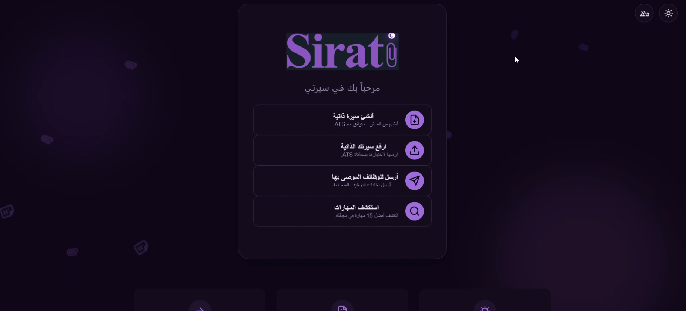
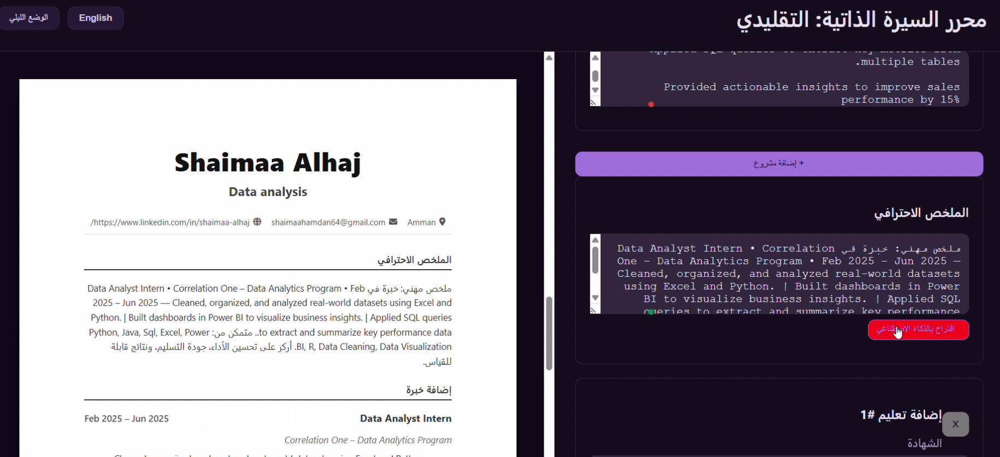
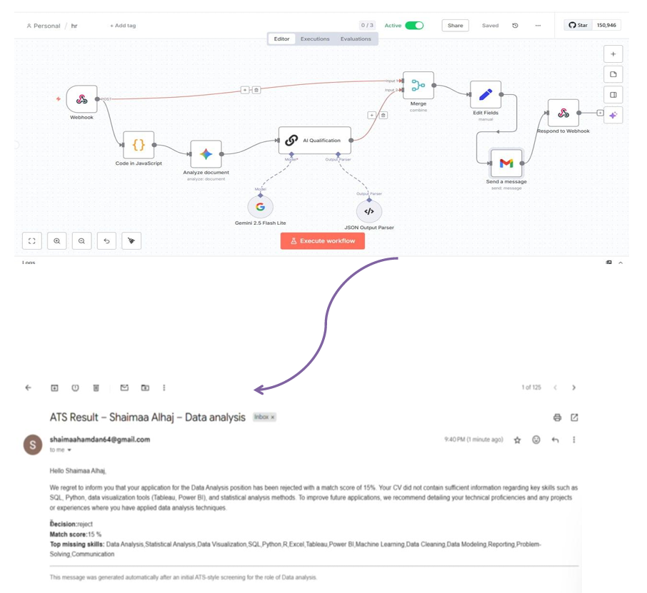
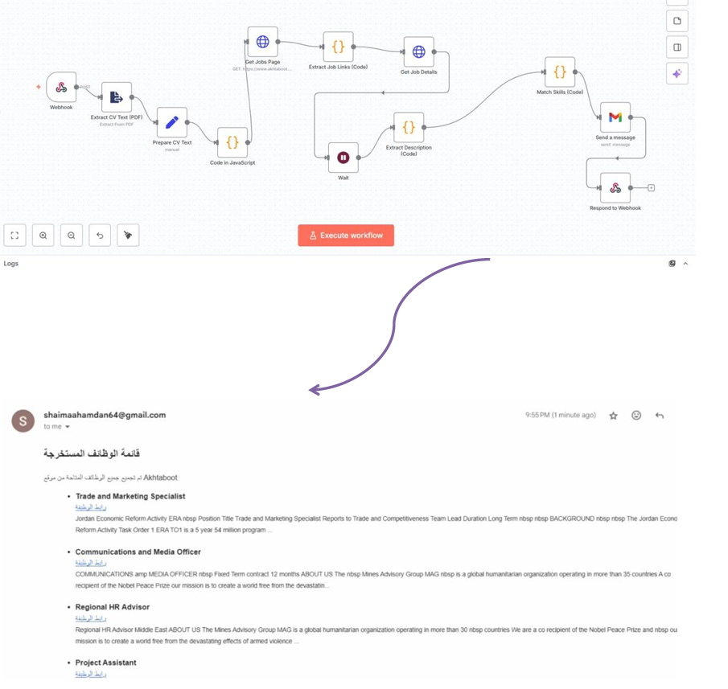
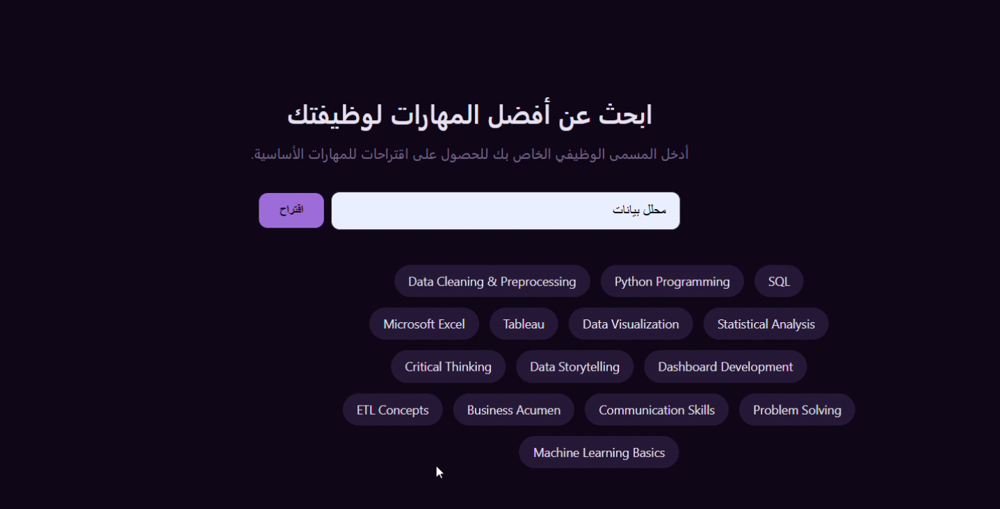

# 🤖 Sirati (سيرتي) - All-In-One AI Career Tool

  
  
  
  
  

---

**Sirati** is an intelligent, multifaceted career ecosystem designed to empower job seekers by bridging the gap between talent and modern recruitment technologies. It automates the tedious job search process, optimizes resumes to bypass strict Applicant Tracking Systems (ATS), and provides data-driven career insights using advanced AI agents and robust backend automation.

👉 **Core Mission:** To transform the job-seeking process from a daunting, manual task into a strategic, automated, and effective professional development journey.

## 📌 Table of Contents
- [The Problem & The Solution](#-the-problem--the-solution)
- [Key Features & The User Journey](#-key-features--the-user-journey)
- [System Architecture & Backend Automation (n8n Workflows)](#%EF%B8%8F-system-architecture--backend-automation-n8n-workflows)
- [Tech Stack](#%EF%B8%8F-tech-stack)
- [Application Walkthrough & Screenshots](#-application-walkthrough--screenshots)

---

## 🎯 The Problem & The Solution

### 🔍 Challenge 1: The ATS Black Hole
* **The Problem:** Talented individuals and fresh graduates frequently have their resumes filtered out automatically by Applicant Tracking Systems (ATS) due to purely technical formatting flaws or missing industry-specific keyword matches—long before ever reaching a human hiring manager.
* **The Sirati Solution:** **ATS Simulation & Analyzer Engine.** The system instantly extracts plain text from uploaded CVs, processes it through an advanced AI model configured with corporate recruitment standards, and provides immediate, actionable feedback on structural compatibility, match scores, and exact missing keywords.

### 🕒 Challenge 2: The Exhausting Manual Job Hunt
* **The Problem:** Job hunting is notoriously strenuous, time-consuming, and highly inefficient. Candidates waste hours every day manually browsing, filtering, tailoring, and applying across dozens of fragmented job boards.
* **The Sirati Solution:** **Automated Personal Recruitment Agent.** Sirati leverages asynchronous background web scraping, intelligent text extraction, and semantic matching pipelines to continuously scout external platforms like *Akhtaboot*, aggregate relevant openings, and deliver customized career matching digests right to the user's inbox.

---

## 🚀 Key Features & The User Journey

The application starts at a centralized web dashboard, offering four major operational gateways:

### 1. Create CV (Build from Scratch — ATS-Ready)
* Provides carefully designed, highly optimized, machine-readable resume templates (*Prime ATS, Classic, Traditional, & Extra Details*) ensuring structure compatibility with modern parsers.
* **AI-Enhanced Content Writing:** Includes a built-in "Suggest with AI" button. When triggered, a dedicated AI agent analyzes the entered experience and dynamically generates highly impactful professional summaries tailored to the user's career path.
* Instantly renders and generates downloadable, cleanly formatted PDFs upon completion.

### 2. Upload CV (ATS Simulation & Analysis)
* Users upload their existing PDF resumes to evaluate them against real-world ATS algorithms.
* The system simulates machine vision, delivering a comprehensive reporting profile including: **Match Score**, **Mastered Skills (Strengths)**, **Missing Skills**, and **Actionable Improvement Recommendations**.

### 3. Send CV to Recommended (Automated Application Matching)
* Acts as a personal recruitment agent. Upon uploading a resume, the platform extracts crucial user metadata, actively cross-references live external job market openings, computes match statistics, and delivers a targeted career digest right to the user's inbox.

### 4. Explore Skills (Market-Demand Intelligence)
* Allows real-time skill mapping based on market trends. Users input a specific target job title (e.g., *Chemical Engineer* or *Data Analyst*), and the application extracts and displays the top 15 in-demand skills ranked by industry importance.

---

## ⚙️ System Architecture & Backend Automation (n8n Workflows)

Sirati's engine is powered by asynchronous background workers, structured API integrations, and LLMs orchestrated seamlessly via **n8n orchestration workflows**. Below is the deep-dive technical blueprint of the operational pipelines:

### Workflow A: AI-Enhanced Content Writer (CV Summary Generator)
Ensures interactive, low-latency contextual enhancement for building resumes.
* **Execution Blueprint:** The process starts when an HTTP Webhook receives user profile metadata from the browser interface. It passes it directly to a *Generate Summary Node* holding the Gemini model. The model processes the raw background text to output a professional, high-impact summary statement, which is immediately returned to the user's interface via the *Respond to Webhook Node*.

### Workflow B: ATS Simulation & CV Analyzer
Runs parallel preprocessing tasks to achieve fast semantic comparisons.
* **Execution Blueprint:** Accepts the uploaded binary PDF file and target job data through an active Webhook. The pipeline splits into two parallel tracks: one extracts absolute text from the PDF file, while the other executes an HTTP request fetching the target job description metadata (cleaned via a dedicated Text Cleaner node). Both datasets are combined in a *Merge Node*, ingested into the main *AI CV Analyzer* node (utilizing **Gemini models**), mapped onto a strictly structured JSON template, and sent back as a parsed, front-end ready object.

### Workflow C: Automated Job Matching & Recruitment Pipeline (Akhtaboot Scraper)
An end-to-end automated scraping and notification delivery network.
* **Execution Blueprint:** The user uploads their CV file. The system extracts raw text and uses a JavaScript Code node to isolate the user's current contact info and target job title. It triggers a web scraping workflow over live *Akhtaboot* job boards to pull all active matching URLs. A loop extracts descriptions for every single job link discovered. An AI matching node calculates percentage scores, constructs an analytical summary report, and executes a **Gmail SMTP / API Node** to deliver a cleanly styled HTML email report containing job descriptions, links, and compatibility rankings straight to the user's inbox.

### Workflow D: Send to HR Evaluation (The "Send to HR" System)
Simulates automated corporate entry qualification loops.
* **Execution Blueprint:** Triggers when a candidate submits their optimized resume directly to corporate portals. A webhook captures the data, normalizes fields via a JavaScript code block, runs a pre-qualification review using Gemini to calculate absolute corporate compliance scores (resulting in an initial simulated Accept/Reject decision and identifying top missing requirements), compiles the final output document, and pushes an email alert containing the structural assessment report directly to HR or back to the applicant.

### Workflow E: Market-Demand Skill Discovery (Top 15 Skills Engine)
* **Execution Blueprint:** A lightweight, highly efficient lookup service. Receives a user-defined job title via an incoming webhook, transfers the string immediately to an active AI model node configured specifically to assess live labor market databases, derives a ranked array of the top 15 fundamental skill matrices for that domain, and serializes the structured list directly back to the responsive frontend UI tables.

---

## 🛠️ Tech Stack

* **Frontend UI/UX:** HTML5, CSS3, JavaScript (ES6+), React Framework, Bootstrap 5.3 Framework (Fluid Layouts, Custom Purple Palette Components).
* **Backend Application Logic:** PHP 8.x, Webhook Data Transmission Architecture, JSON Serialization.
* **Database Management System:** MySQL (Structured Storage for User Credentials, Configuration Metadata, Application State History).
* **Automation & Pipelines:** n8n Workflow Automation Platform (Self-hosted/Cloud Node Execution, HTTP Request Nodes, Logic Merges).
* **Artificial Intelligence Layer:** Gemini API (Gemini Models, Custom System Prompts, Structured JSON Output Generation).

---

## 📸 Application Walkthrough & Screenshots

### 1. Platform Dashboard (The Landing Gateway)

  

### 2. Interactive CV Builder & AI Assistant (Suggest with AI)

  

### 3. Send to HR Qualification Loop & Automated ATS Email Report

  

### 4. Akhtaboot Automated Scraper Workflow & Extracted Jobs Email Digest

  

### 5. Market Skills Discovery Tool (Top 15 Skills Search)

  

-----
### 🎥 System Demo Video
Check out the full workflow and user journey of Sirati in action:

  <video src="screen/video_2026-06-17_00-38-19.mp4" width="100%" controls></video>

-----

